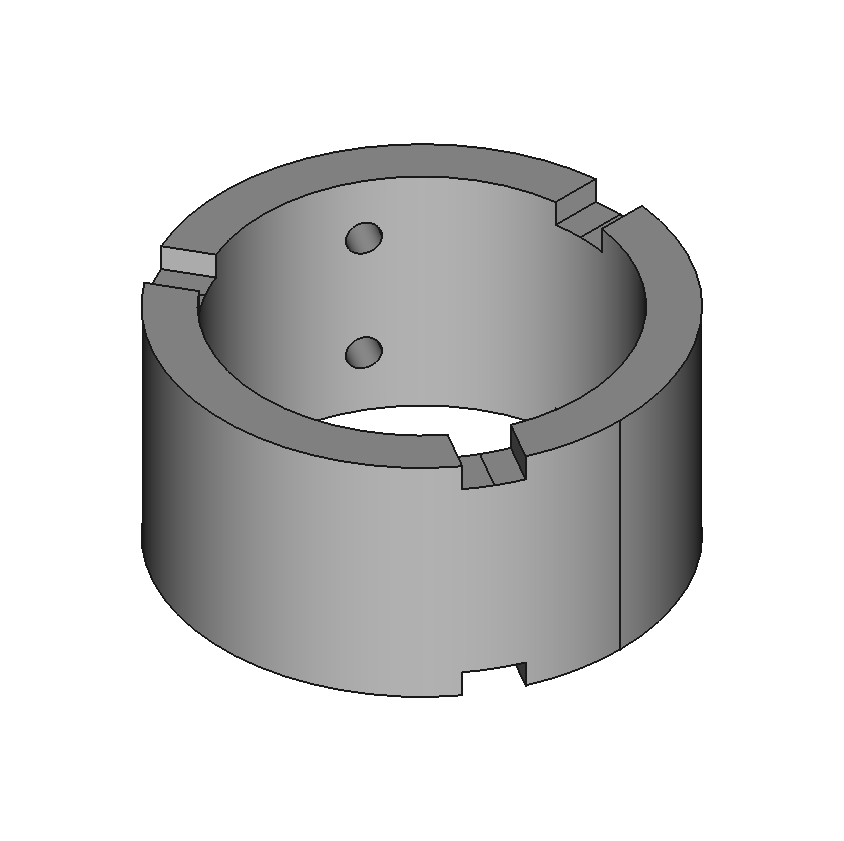
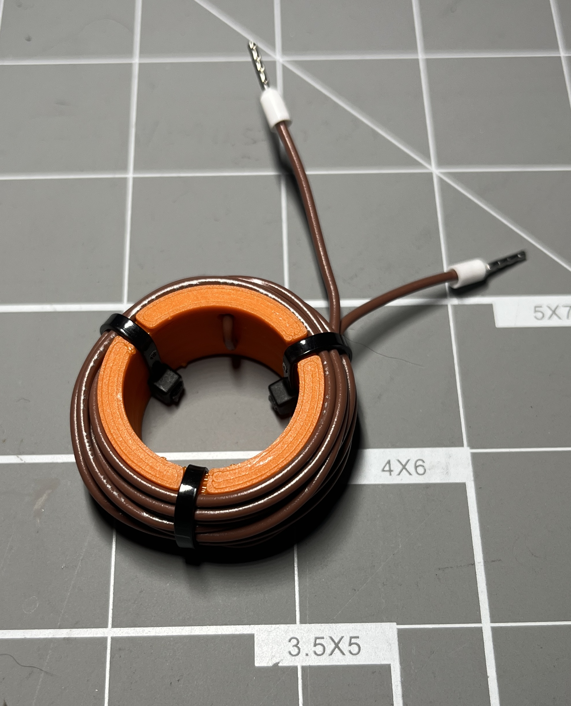

# Thunder Shunt
Wire-wound shunt resistor holders

Inspired by [this](https://youtu.be/j4u8fl31sgQ) video from Electroboom, this FreeCAD model is a fully parametric shunt resistor wire spool.

## Instructions
1. Open the file in FreeCAD.
2. Open the spreadsheet `params` and modify as needed:
    - Cylinder OD, Height, and Thickness change the base cylinder.
    - Set the Wire Holes ID to fit the wire being used.
    - Set the Slots width and depth to fit the zip-ties being used. Change the number to match how many zip-ties will be used.
3. The part design body will update automatically. If it does not, check that your parameters aren't conflicting (i.e. overlapping zip-tie slots).
4. Export and slice with your program of choice, then print.
5. Thread the wire through the two holes from the inside such that the centerpoint of the wire is between the holes on the inside of the cylinder.
6. Wrap the wire around the cylinder and zip-tie at the slots.
7. Terminate your wires however you like, and enjoy your shunt resistor!

